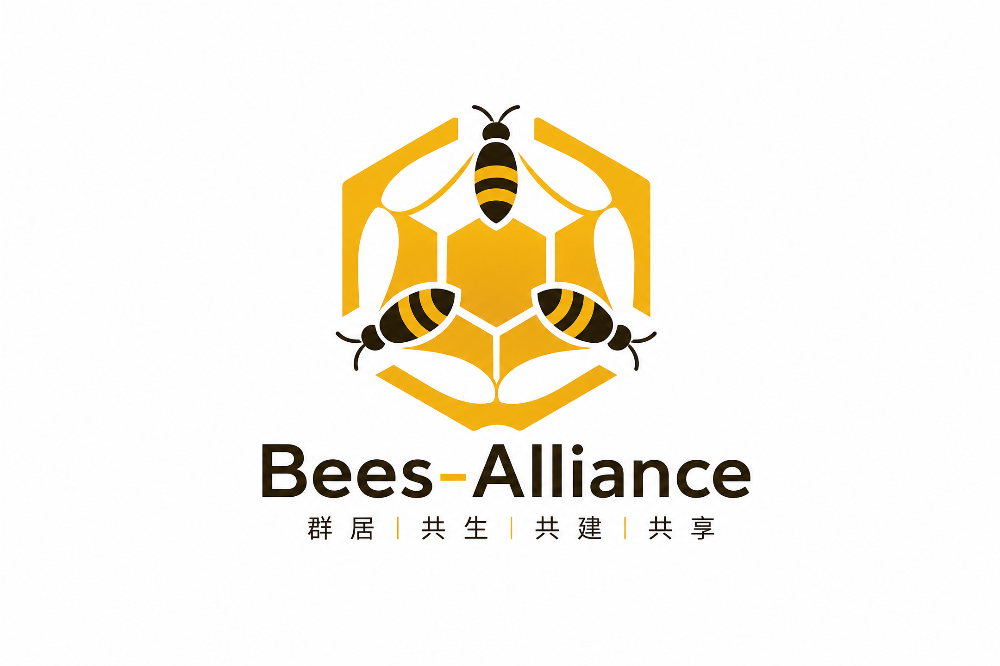

# 微光を星河に集め、共生で独占を打ち破る——Bees-Alliance 蜂盟 共同富裕宣言

[English](README.en.md) · **日本語** · [한국어](README.ko.md) · [Français](README.fr.md) · [中文](README.md)

この時代、努力する人は少なくないが、足りないのは**団結する人々**である。

私たち一人ひとりの普通人、創業を志す者、業界に深く根を下ろす奮闘者は、まるで小さく勤勉な蜜蜂のような存在です。誠実に働き、静かに貢献し、夜昼となく勤しみます。努力は必ず報われ、奮闘には必ず実りがあると信じています。

しかし現実はこう告げます。**個人が勤しめば資本が刈り取り、衆人が創造すれば少数が独占する。**

長きにわたり、独占資本がチャネルも、ルールも、トラフィックも、価格決定権も握ってきました。資本は内巻を、競争を、不安を人為的に創り出し、数え切れないほどの奮闘者たちを互いに争わせ、消耗させ、皆の汗も時間も創造力も、結局はわずかな巨大資本たちの富を増やすだけに仕向けています。

私たちは走り回っても成果を残せず、共に価値を創っても配当を分かち合えない。

これは私たちの努力が足りないからではなく、**一人で行く時代は、とっくに公平さを失っているのです。**

しかし蜜蜂の知恵は、決して孤軍奮闘にはありません。
蜜蜂の最も偉大な力は**群居し、共生し、共建し、共有すること**にあります。

Bees-Alliance 蜂盟は、まさにこの不公正を打破し、業界の生態を再構築し、普通の人々の共同富裕を実現するために誕生しました。

私たちは資本の刈り取りをせず、階層による搾取をせず、内巻競争を演じません。
私たちが行おうとしているのは、**普通の人々が団結し、集団の力で資本の独占に立ち向かうこと**です。

1. **私たちは内耗競争を拒否し、互助共生の新しい秩序を築く**
かつて資本は、私たちが奪い合い、互いに値下げし、疑心暗鬼になることを好みました。私たちが分散すればするほど資本は支配し、私たちが内巻すればするほど巨大資本は利益を得る。
蜂盟はこのルールを完全に覆します。**対内では互いに助け合い、資源を共有し、経験を共有し、互いを成就させること。対外的には結束して力を合わせ、声を一つにし、共に発展し、共に前進すること。**
内巻を消滅させ、善意を回復させ、すべての奮闘者が孤立しないようにします。

2. **私たちは資本の独占を打ち破り、属于普通人の発言権と収益権を取り戻す**
資本独占の本質は、資源・機会・利潤の独占にあります。
しかし私たち無数の従事者の労働、トラフィック、市場、評判こそが、業界の真の礎です。
蜂盟が行うのは、**分散した微小な力を磅礴たる合力に集結させ**、資本の集権を共同協業で置き換え、寡頭の独占を共建共有で置き換え、ルールを公平に戻し、資源を大衆に戻し、利潤を創出者に返すことです。

3. **私たちはパートナーへの全心全意の奉仕を堅持し、人人共富の共同体を築く**
私たちは常に、人民への全心全意の奉仕という初心の趣旨を貫き、**大きな資本を作らず、共同体だけを作る**。
私たちには高高在上の資本階層はなく、肩を並べて進む創業パートナーだけがある。
一部の者の暴利による刈り取りはなく、**多労多得、共建共有、全員配当、共同富裕**だけがある。

すべての付出は見え、すべての貢献は回馈され、すべての価値は共有される。
勤勉な小さな蜜蜂は、花の蜜を見つけることができる。誠実に共に行動するパートナーは、必ず收获を得る。

独りでは一歩も行けず、衆で行けば万局を打破できる。
資本は市場を独占できるが、**団結・善良・勤勉・共生**を永遠に独占することはできない。

ここに、平凡に甘んじず、刈り取られず、公平を求め、共同富裕を追求するすべての奮闘者へ、最も誠意ある、断固たる呼びかけを行います。

**志を抱き、初心を堅持し、着実に動くすべての同道者の皆さん、Bees-Alliance 蜂盟に参加してください！**
猜忌を捨て、内耗を捨て、手を携え、結束して共建しよう。
蜂の勤勉さで業界に根を張り、群れの力で独占を打ち破り、共生の心で配当を分け合おう。

私たちは共に、**普通の人々自身のプラットフォーム・ルール・事業・财富共同体を建設する**。
これより、**労働に尊厳があり、奮闘に回报があり、価値は共有され、全員が共に富む！**

微光が集まれば、ついに星河となる。衆生の心が一つになれば、共に繁盛へと至る。
平凡の力で非凡の盛世を造ろう！
**人人創造、人人共有、人人富裕、人人栄光！**